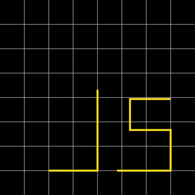

# Lesson 2: arrays and objects

## Learn git, part 2

In a Terminal window:

1. change to the `tts-js-app-dev-2018c` directory into which you cloned the repository
2. `git status`
3. `git add --all`
4. `git commit -m "My changes to files in lesson 1"`
5. `git checkout master`
6. `git pull`
7. `git checkout -b 2018-10-04` to make a branch for your changes in lesson 2
8. `cd 2018-10-04` for this lesson

## array literal

An array contains a sequence of items.

* An **array literal** is enclosed in brackets and contains items separated by commas.
* An **item** has an **index** which is an integer. The first item has `0` as its index.
* To get or set the value of a item, use **bracket notation** with an index.
* An array is a specialized object which has a `length` property.

A web application might render items in an array as `li` elements in `ul` or `ol` list element.

## array index, part 1

[Fibonacci sequence](https://en.wikipedia.org/wiki/Fibonacci_number) consists of numbers which are the **sum** of the two **preceding** numbers.

The [golden ratio](https://en.wikipedia.org/wiki/Golden_ratio) is the limit of the ratio in which the numerator is a Fibonacci number and the denominator is the preceding number in the sequence.

For example, display some computed ratios of Fibonacci numbers and the golden ratio:

1. In your code editor, open the `01-array-index.js` file
2. In Terminal: `node 01-array-index.js`

Will three volunteers each do one of the following:

* say initial length of `fibonacci` array
* say the final length of `fibonacci` array
* trace the code line by line

You can use array [`push`](https://developer.mozilla.org/en-US/docs/Web/JavaScript/Reference/Global_Objects/Array/push) method to add an item at the end.

1. Edit the `01-array-index.js` file:

    * replace `fibonacci[i] = fibonacci[i - 1] + fibonacci[i - 2];`
    * with `fibonacci.push(fibonacci[i - 1] + fibonacci[i - 2]);`

2. In Terminal: `node 01-array-index.js`

## array index, part 2

A [polynomial](https://en.wikipedia.org/wiki/Polynomial) is an expression consisting of **variables** and **coefficients** with operations of addition, subtraction, multiplication, and non-negative integer exponents of variables.

For example, compute `y = 3x² - 5x + 4` for a given value of `x`

Will a volunteer say what is the value of `y` if `x` is 2

1. In your code editor, open the `02-array-index.js` file
2. In Terminal: `node 02-array-index.js` press space bar, type a value of x, and then press `enter` or `return`

The [`process.argv`](https://nodejs.org/dist/latest-v8.x/docs/api/process.html#process_process_argv) property returns an array containing the command line arguments passed to the Node.js process.

Will a volunteer say what are the first two items in the `process.argv` array.

Will another volunteer trace the code line by line.

The **index** of each item in the `coefficients` array corresponds to the exponent in the polynomial.

For example, `coefficients[2]` is `3` for `3x²`

Many mathematicians think of the coefficients in the opposite order.

The [`reverse`](https://developer.mozilla.org/en-US/docs/Web/JavaScript/Reference/Global_Objects/Array/reverse) method swaps the first item with the last item, and so on.

1. Edit the `02-array-index.js` file:

    * delete `//` at beginning of the first line
    * add `//` at beginning of the second line

2. In Terminal: `node 02-array-index.js`

## array push

Will a volunteer trace the following code line by line, especially the value of `clubs.length`

```js
const clubs = ['10♣', '9♣'];
clubs.push('5♣');
clubs.push('2♣');
```

Will another volunteer say the relationship between array length:

* and index of last item
* and index of next item to be added at end

## array concat

Because it changes the contents of the array, `push` is known as an **impure** method.

You can use [`concat`](https://developer.mozilla.org/en-US/docs/Web/JavaScript/Reference/Global_Objects/Array/concat) method of array returns a new array which has zero or more items added at the end.

Because it doesn’t change the contents of the original array, `concat` is known as a **pure** method.

Will a volunteer say whether array `reverse` method is pure or impure.

1. In your code editor, open the `03-array-concat.js` file
2. In Terminal: `node 03-array-concat.js`

Will a volunteer explain why `clubs1 === clubs2` is `false`.

The `push` and `concat` methods differ in a subtle way that could confuse you :(

1. Edit the `03-array-concat.js` file:

    * add `//` at beginning of `const clubs1 = clubs.concat(['5♣', '2♣']);`
    * paste a new line following it `clubs.push(['5♣', '2♣']);`

2. In Terminal: `node 03-array-concat.js`

Will two volunteers each do one of the following:

* Suggest how `.push(['5♣', '2♣'])` differs from `.concat(['5♣', '2♣'])`
* Explain why I asked you to paste new line after instead of before assignment to `clubs2`

## array slice

The [`slice`](https://developer.mozilla.org/en-US/docs/Web/JavaScript/Reference/Global_Objects/Array/slice) method returns a new array which contains items from:

* a **start** index (default is 0)
* up to but **not including** an **end** index (default is length of array)
* a **negative** index means an offset from the end of the array

Here is a program to “cut” a hand of cards (instead of the whole deck :)

1. In your code editor, open the `04-array-slice.js` file
2. In Terminal: `node 04-array-slice.js`

Will a volunteer suggest a way to make a new array which consists of the cards in different order: the cards after the cut followed by the cards before the cut

## array spread

In an array literal, the ... [spread operator](https://developer.mozilla.org/en-US/docs/Web/JavaScript/Reference/Operators/Spread_syntax) means “spread out” the items of an array.

Here is an analogy of spreading out cards of each suit into a hand:

```js
const hearts = ['A♥', '7♥', '6♥']
const diamonds = []
const clubs = ['10♣', '9♣', '5♣', '2♣']
const spades = ['J♠', '9♠', '8♠', '7♠', '5♠', '2♠']

const cards = [...hearts, ...diamonds, ...clubs, ...spades]
```

The array literal implies a new array instance, therefore immutable data.

| General pattern | Specific example |
| --- | --- |
| **Copy** an array | `[...array]` |
| **Append** an item to the end | `[...array, item]` |
| **Prepend** an item at the start | `[item, ...array]` |

Here how you can use spread operator to put together the cards after a cut:

```js
const cardsAfterCut = [...cards.slice(index), cards.slice(0, index)];
```

## array indexOf

The [`indexOf`](https://developer.mozilla.org/en-US/docs/Web/JavaScript/Reference/Global_Objects/Array/indexOf) method returns either the index in the array of the first occurrence of the item argument; otherwise `-1`

For example, return the index or `-1` of a card (for example, 2♣ or 3♦) that might be in a hand.

| suit | symbol |
| :--- | :--- |
| hearts | ♥ |
| diamonds | ♦ |
| clubs | ♣ |
| spades | ♠ |

1. In your code editor, open the `06-array-indexOf.js` file
2. In Terminal: `node 06-array-indexOf.js` press space bar, type a card, and then press `enter` or `return`

## array join

The [join](https://developer.mozilla.org/en-US/docs/Web/JavaScript/Reference/Global_Objects/Array/join) method returns a string which consists of the items (converted to strings) joined by a joiner string.

| string | description |
| :--- | :--- |
| `','` | comma is the default |
| `', '` | comma space |
| `' '` | space |
| `'\n'` | newline (that is, each item starts on new line) |
| `''` | empty string (that is, concatenate items without separation) |

In pairs, edit the `07-array-join.js` file:

1. **Pilot and Navigator**: In your code editor, open the `07-array-join.js` file
2. **Navigator**: Suggest what to do and why to do it:
    * output cards joined into a string
3. **Pilot**: Save your changes, and then in Terminal: `node 07-array-join.js`
4. Repeat for several all of the preceding joiners, and each choose an additional joiner.

## string split

The [split](https://developer.mozilla.org/en-US/docs/Web/JavaScript/Reference/Global_Objects/String/split) method splits a string into an array of substrings, using a specified separator string to determine where to make each split.

* If separator is omitted or does not occur, the array contains one item consisting of the entire string.
* If separator is an empty string, the array consists of UTF-16 code units (so don’t do it).

In pairs, change roles to edit the `08-string-split.js` file:

1. **Pilot and Navigator**: In your code editor, open the `08-string-split.js` file
2. **Navigator**: Suggest what to do and why to do it
    * join names with `', '` comma space, and then
    * output split string with `', '` comma space
3. **Pilot**: Save your changes, and then in Terminal: `node 08-string-split.js`
4. Repeat for another choice of string as the joiner and splitter.

Will a volunteer say what is the problem with joining, and then splitting, with the first string.

## array includes

The array [`includes`](https://developer.mozilla.org/en-US/docs/Web/JavaScript/Reference/Global_Objects/Array/includes) method returns as a boolean value whether the item argument occurs or not.

| suit | symbol |
| :--- | :--- |
| hearts | ♥ |
| diamonds | ♦ |
| clubs | ♣ |
| spades | ♠ |

While we’re at it, let’s find whether zero or more cards are in the hand of cards.

In pairs, change roles to edit the `09-array-includes.js` file:

1. **Pilot and Navigator**: In your code editor, open the `09-array-includes.js` file
2. **Navigator**: Suggest what to do and why to do it
    * for each item in options
    * output whether or not cards includes the option
3. **Pilot**: Save your changes, and then in Terminal:
    * type `node 09-array-includes.js`
    * press space bar, type a card, and then repeat for as many cards as you want
    * and then press `enter` or `return`

Will a volunteer explain the difference between:

* `process.argv[2]`
* `process.argv.slice(2)`

## array destructuring

With a similar **literal** notation, put together and take apart an array.

Will a volunteer trace the following code line by line:

```js
// Put together at right of = with array literal notation
const point = [0.25, 0.875];

// Take apart at left of = with array destructuring
const [x, y] = point;

console.log(x === point[0], y === point[1]);
```

Will another volunteer suggest what is value of `z` if you change assignment to `const [x, y, z] = point;`

Will yet another volunteer explain the following idiom:

```js
let x = 0.25;
let y = 0.875;

[y, x] = [x, y];
```

In pairs, change roles to edit the `10-array-destructuring.js` file:

1. **Pilot and Navigator**: In your code editor, open the `10-array-destructuring.js` file
2. **Navigator**: Suggest what to do and why to do it
    * use array destructuring assignment
    * with spread operator
    * to assign `cardFirst` as first card items and `cardsRest` and a new array of rest of card items
3. **Pilot**: Save your changes, and then in Terminal: `node 10-array-destructuring.js`

## object

An object consists of properties. Each **property** has:

* **key**, also known as name, which is a string (or a number converted to a string)
* **value**, which is any type

To make an object using **literal** notation, enclose it in braces.

```js
const point = {
  x: 0.25,
  y: 0.875,
};
```

To get or set the value of a property, you can use **dot notation** with a key:

```js
const x = point.x;
const y = point.y;
```

Most times when you see a list or table in a web application or a scrolling list on a mobile device, the JavaScript code renders an **array of objects**.

For example, here is an array of 3 points to render a stick J in the JavaScript community logo.

```js
const pointsJ = [
  { x: 1 / 2, y: 29 / 63 },
  { x: 1 / 2, y:  7 /  8 },
  { x: 1 / 4, y:  7 /  8 },
];
```



Will a volunteer identify which point objects in the array correspond to which points in the graph.

## analogy from CSS style to object properties

Here are style properties in CSS:

```css
table {
  border-collapse: collapse;
  border-spacing: 0;
  width: 100%;
}
```

For which some developers use style objects in React:

```js
const tableStyle = {
  borderCollapse: 'collapse',
  borderSpacing: 0,
  width: '100%',
};
```

You change hyphenated property names in CSS to camelCase property keys in JavaScript.

If a CSS value is not a number, enclose it in quote marks to make it a string.

## object property

Given the array of point objects:

```js
const pointsJ = [
  { x: 1 / 2, y: 29 / 63 },
  { x: 1 / 2, y:  7 /  8 },
  { x: 1 / 4, y:  7 /  8 },
];
```

Here is the value of an **ideal** points attribute `0.5,0.460 0.5,0.875 0.25,0.875`

In pairs, change roles to edit the `11-object-property.js` file:

1. **Pilot and Navigator**: In your code editor, open the `11-object-property.js` file
2. **Navigator**: Suggest what to do and why to do it
    * for each item in `pointsJ`
    * assign to corresponding item in `pointsFormattedJ` the `x` and `y` coordinate separated by comma
    * assign to `points` a string which consists of formatted items joined by space
3. **Pilot**: Save your changes, and then in Terminal: `node 11-object-property.js`
4. **Navigator**: Suggest what to do
    * limit precision of `x` and `y` coordinate to 3 digits
5. **Pilot**: Save your changes, and then in Terminal: `node 11-object-property.js`

Will a volunteer contrast the strengths and weaknesses of output from steps 2–3 versus 4–5 compared to the **idea** points attribute.

## object destructuring

With a similar **literal** notation, put together and take apart an object.

Will a volunteer trace the following code line by line:

```js
// Put together at right of = with object literal notation
const point = { x: 1 / 4, y:  7 /  8 };

// Take apart at left of = with object destructuring
const {x, y} = point;

console.log(x === point.x, y === point.y);
```

Will another volunteer suggest what is value of `z` if you change assignment to `const {x, y, z} = point;`

Will yet another volunteer explain which is more limited in variable names, and why:

* array destructuring
* object destructuring

1. **Pilot and Navigator**: In your code editor, open the `12-object-destructuring.js` file
2. **Navigator**: Suggest what to do and why to do it
    * assign variables x and y by object destructuring
    * assign to corresponding item in `pointsFormattedJ` the `x` and `y` coordinate separated by comma
    * use explicit number `.toString()` method instead of default conversion to string
3. **Pilot**: Save your changes, and then in Terminal: `node 12-object-destructuring.js`
4. **Navigator**: Suggest what to do
    * limit precision of `x` and `y` coordinate to 3 digits
5. **Pilot**: Save your changes, and then in Terminal: `node 12-object-destructuring.js`
6. **Navigator**: Suggest what to do
    * assign to `xShorter` the shorter string `xToString` or `xToFixed3`
    * assign to `yShorter` the shorter string `yToString` or `yToFixed3`
    * assign to corresponding item in `pointsFormattedJ` the `xShorter` and `yShorter` coordinate separated by comma    
7. **Pilot**: Save your changes, and then in Terminal: `node 12-object-destructuring.js`

Will a volunteer explain why the variables can be `const` even though the value change in each iteration of the `for` loop.

## object mutate

To change a property (also known as mutate the object), you can use **dot notation** with a key.

For example, scale the value of points.

1. In your code editor, open the `13-object-mutate.js` file
2. In Terminal: `node 13-object-mutate.js`

## object assign

The [`Object.assign`](https://developer.mozilla.org/en-US/docs/Web/JavaScript/Reference/Global_Objects/Object/assign) method merges properties of its arguments from left to right.

In the **pure** idiom to make a copy with or without changes, the first argument is `{}` an empty object:

```js
const point = {
  x: 0.25,
  y: 0.875,
};

const pointChanged = Object.assign({}, point, {x: 0.5});
```

1. In your code editor, open the `14-object-assign.js` file
2. In Terminal: `node 14-object-assign.js`

## object spread

In an object literal, ES2018 includes `...` [spread operator](https://developer.mozilla.org/en-US/docs/Web/JavaScript/Reference/Operators/Spread_syntax) for properties. It works in Node.js 8.6.0, Firefox 55, Chrome 60, Safari 11.1, but not Edge 17.

The object literal implies a new object instance, therefore immutable data.

The last value for a repeated key is the winner.

| ES2015 | ES2018 |
| --- | --- |
| `Object.assign({}, object, {key: value})` | `{...object, key: value}` |

```js
const point = {
  x: 0.25,
  y: 0.875,
};

const pointChanged = {...point, x: 0.5};
```

1. In your code editor, open the `15-object-spread.js` file
2. In Terminal: `node 15-object-spread.js`
