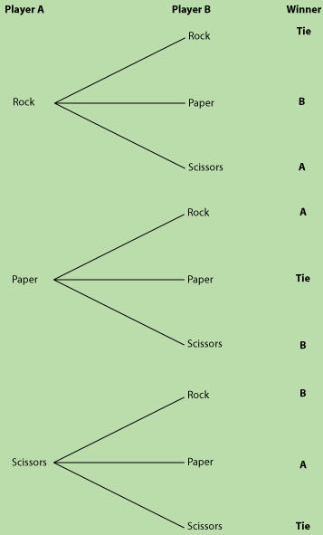

# Lesson 1 - Intro & Syntax


## Welcome & Class Overview
* Intro / Ice Breaker
	1. What’s your name?
	2. Where are you from?
	3. What background in programming do you have, if any? (HTML/CSS?, JS?, Ruby?, Python? etc)
	4. What do you want to do after you complete the class?
	5. Tell us about a time you met a famous person. If you didn’t, who would you like to meet?

* This is an ACCELERATED course
* Starts with language basics to build the foundation
* 5 weeks in, we switch gears to bleeding edge JS (ES6, React, Webpack, )
* Pre Reqs:
	* HTML/CSS
	* Git

## Administrative

* **OS** - macOS or Linux
* **Text Editor** - Sublime Text, Atom, or VS Code.
* **Node** - Download and install https://nodejs.org
* **Google Chrome/Firefox**
* **Github Account** - https://github.com/ttsJavaScriptApps
* **Slack**
* **Cadence** - Computers down for lecture. Pairing for exercises, the importance of homework

## Syllabus
1. Intro to JS
2. Arrays and Objects
3. Functions
4. Object Orientation
5. Working with Data
6. JS in the Browser
7. DOM
8. jQuery
9. API's & Promises
10. Application Setup
11. Build Systems (Webpack)
12. ES6
13. React Basics
14. React Routing
15. Firebase
16. Applications with React & Firebase (5 classes)

## Today's Agenda
* What is JavaScript and how did we get here?
* How does JS compare to other languages?
* Where is JS used?
* variables and flow control

## History

### Invention
* 1995 Netscape wanted to add scripting to web pages
* Brandon Eich wrote the first version in 10 days

### JavaScript is NOT JAVA
* Originally called Mocha, then LiveScript, then JavaScript
* Netscape marketing department named it JavaScript to capitalize on popularity of Java
* Eich was a fan of functional language Scheme which heavily influence JavaScript

### JavaScript was designed for hobbyists
* Easy to learn
* Forgiving
* loose typing
* JavaScript has a bad name because much bad code was written by amateurs
* But its open nature made it extremely popular

### Where does JS run?
* Browser engines
* Web server (NodeJS)
* Databases (mongo, rethink, couchdb)
* Commandline tooling
* Native mobile (JavaScriptCore)
* Desktop OSX (JavaScript for Automation in Yosemite), Windows

### Open platform
* JavaScript's official name is EcmaScript!
* ECMA maintains and updates Standards (TC39 committee)
* ECMA doesn't produce a JS runtime
		* vendor specific - google, MS, mozilla - (V8, Chakra, SpiderMonkey, Rhino)
* Open platform -> fragmentation (features and performance)
		* Features - Often implementation happens before specification
		* Performance - different performance characteristics
* Most JS is ES5, but ES6 was ratified summer of 2015


## Variables & Typing
* 'var' keyword
* int, number, float, date
* loose typing
* dates
* Math - min, max, floor, ceil, sin, cos, etc.


### Variable declaration
Variables are declared with var. All statements in JS end with a semicolon.

```javascript
const x = 1;
const y = "2";
const z = true;
```

### Loose typing
variables are declared with var, but have a type that can be changed

```javascript
const z = 1;
z = 'abc'; //would throw an error in strong typed languages
typeof z //string
z = 1
typeof z //number
```

### Coersion
variable type is coerced to a type that makes sense when reached

**IMPLICIT** coercion

```javascript
7 + 7 + 7; // = 21


// First two 7's are calculated... then concatened into a string.
// returning a string value
7 + 7 + "7"; // = "147"

// The entire expression is implicitly converted into a string and concatenated
"7" + 7 + 7; // = "777"
```
Above, when we add Integers (numbers) together, we get a sum of 21.
However, in our second example. The first two 7's are calculated and then, converted into a string and concatenated with the string value of 7.
In the final example, the entire expression is almost immediately converted into a string.

**EXPLICIT** coercion:

As you can see, JavaScript is trying to be helpful, and sometimes this is the desired behavior.
However, what happens when you retrieve data from a user and it needs to be forcibly coerced? This is where Explicit coercion comes in.

Let's say you are helping a local non-profit raise funds and the pledges are coming in through the website. Obviously, the data is going to come in a string. It then needs to be coerced into a number (so that it can be added).

Here's an example:

```javascript
// perform in browser of JS Bin
const amountRaisedSoFar = 1000;

const newDonation = prompt("How much would you like to donate?");

amountRaisedSoFar = Number(newDonation) + amountRaisedSoFar;

console.log("We have now raised: " + amountRaisedSoFar + "!");
```

Here we are taking the user input in as a string, then converting it into a number when adding it to the amountRaisedSoFar variable.


### Type Casting
You can convert from one type to another using these other built-in conversion functions as well.

* `ParseInt`
* `parseFloat()`
* `toString()`

### `null` and `undefined`

According to the [Mozilla Documentation](https://developer.mozilla.org/en-US/docs/Web/JavaScript/Reference/Global_Objects/undefined)
> A variable that has not been assigned a value is of type undefined.

```javascript
const something;
typeof something // "undefined"
```

According to [Ajay Matharu](http://www.ajaymatharu.com/javascript-difference-between-undefined-and-null/)
> On the other hand, null is an assignment value. It can be assigned to a variable as a representation of no value.

(slightly modified) code sample from [Mozilla Documentation](https://developer.mozilla.org/en-US/docs/Web/JavaScript/Reference/Global_Objects/null):

```javascript
// foo does not exist, it is not defined and has never been initialized:
foo; // "ReferenceError: foo is not defined"

// foo is known to exist now but it has no type or value:
const foo = null;
foo// "null"
```

Don't spend too much time on `null` at the moment. It will become clear when the time arises to use it.

In short...<br>
A variable that never declared is `undefined`.
A variable that is declared but not assigned a value is `null`.

```javascript
something; //undefined
const something; //null
```

## Break


## Flow control
* if
* Operators (<>, = vs == vs ===)
* truthy values
* for
* while
* continue
* switch/case & break statement


### `If` statement
```javascript
//Simple if statement
const x = true;
if(x) {
	console.log(true);
} else {
	console.log(false);
}
```

**CHALLENGE 1** Do you need more coffee?<br>
(3 minutes)

Write a script that:

- stores the number of cups (that a person has consumed) in a variable
- if the person has had *less than* 3 cups
	- log a message to the console saying: ("Yes I'll take another cup of coffee")
- if not
	- log a message to console saying ("I think I'm okay for now")   


**CHALLENGE 1 ANSWER:**

```javascript
const cups = 1

if(cups < 3){
    console.log("Yes. I'll take another cup of coffee!");
} else {
    console.log("I think I'm okay for now.");
}
```

### Loose Equality
The double equals `==` tries to ignore the type when comparing. The triple equals `===` takes into account type. These are called loose and strict equality checks. You pretty much always want to use strict.

```javascript
const x = 10;
//Type coersion is happening here!
if(x == '10') {
	console.log(true); //true
}

if(x === '10') {
	console.log(true); //false
}
```

### Truthy and Falsey Values
Pretty much all objects and variables are coerced to `true`.

```javascript
if('abc') {
	//true
}

if(10 && 'abc' && true) {
	//true
}
```

Only falsey values: `false`, `0`, `null` or `undefined` evaluate to false

```javascript
const whatever;
if(false || 0 || null || whatever) {
	console.log(true)
} else {
	console.log(false);
}
```

### Comparison Operators
* `<`
* `>`
* `<=`
* `>=`
* `==`
* `===`
* `!=`
* `!==`
* `!!`


### Short-circuit evaluation
As soon as the interpreter knows that a statement will evaluate to `true` or `false`, the rest of the statement is not executed.

```javascript
true || somethingTotallyUndefined;  //true, no error
false && somethingTotallyUndefined; //true, no error
```

Sometimes this is used in place of if statements

```javascript
someconst && myFunction() //equivalant to if(somevar)
someconst || myFunction() //equivalant to if(!somevar)
```

**CHALLENGE 2**<br>
(10 minutes)

1. Create a variable for the temperature and set it to 80
2. Write a statement that outputs the temperature as "The temperature is 80 degrees";
3. If the temp is greater than 80, output "time to swim" (set temp to 60, 90) and test;
4. Create a precipitation variable and set it to false
5. Only output "time to swim" if temp is greater than 80 and its not raining
6. Set the precipitation variable to 'raining' or 'snowing' and only output 'time to swim' if there is no precipitation
7. Create an 'indoors' variable and set it to true
8. If indoors, then output 'time to swim' regardless of the temp and precip.


**CHALLENGE 2 ANSWER:**

```javascript
const temp = 85;
const precipitation = false;
const indoors = true;

console.log("The temperature is " + temp + " degrees");

if (temp > 80 && precipitation === false) {
  console.log("time to swim!");
} else if (indoors) {
  console.log("time to swim!");
}

```

## Iteration

### For loop

```javascript
for (const i = 0; i <= 9; i ++) {
    console.log( i );
}
```

Let's work through each part of the loop.

within the parentheses, there are 3 key things happening:

1. We are **setting** a variable's value (in this case, to 0)
2. We are **comparing** the variable's value to the desired break-point
3. we are **incrementing** the *value* of the variable on each *iteration*


**CHALLENGE 3** - 99 Bottles<br>
(5 minutes)

- Using a `for` loop.
- Write a simple version of "99 bottles of beer on the wall"<br>
(note: make sure you're logging the result to the console)
- Once you get the program running, log "Hey! We need more beer!" to the console when your counter hit's 0


**CHALLENGE 3 ANSWER:**

```javascript
const bottle = 99;

for (bottle; bottle >= 0; bottle --){

  if (bottle === 0) {
    console.log("Hey! Go buy more beer!");
  } else {
      console.log(bottle + " bottles of beer on the wall");
  }
}
```


### While Statement
```javascript
const x = 0;
while(x < 10) {
	x = x + 1;
}
```

### Switch Statement
Cases fall through unless you remember to `break` after each case.

```javascript
const x = 1
switch(x) {
	case 3:
		console.log('three')
	case 1:
		console.log(1);
		//break;
	case 2:
		console.log(2);
		break;
	default:
		console.log('default')
}
```

### Break vs Continue
A `break` statement jumps *out* of the loop.

```javascript
for(const i = 0; i < 10; i++) {
	console.log(i);
	console.log('before break');
	break; // exits the next loop
	console.log('after break'); //never happens
}
```

A `continue` statement jumps to the next *iteration*

```javascript
for(const i = 0; i < 10; i++) {
	console.log(i);
	console.log('before continue');
	continue; // continues to the next iteration
	console.log('after continue'); //never happens
}
```


## Exercise && homework

###**Due 4/04/2019:**

1. Read the following tutorial [JavaScript Strings](http://www.javascriptkit.com/javatutors/string4.shtml)
2. Join our Slack Channel
3. Send me your GitHub username

	*note:<br>when naming your GitHub repo, please use the following naming convention:`rps_aw_lm`<br>(the project name + your team's initials)*

###**Due 4/09/2019:**

4. Work with your partner to create a game of 'Rock Paper Scissors' that runs until one player has three wins

	- Store the player names and number of wins for each player in variables
	- Use a while loop to run the game until one player has 3 wins
	- Use:
	  ```
	  var weapons = ['rock' , 'paper', 'scissors'];

	  var weaponOfChoice = weapons[parseInt(Math.random()*weapons.length) %3];
	 ```
	  to randomly select an item
	- Output each players hand to the console
	- Use an `if` or `switch` statement to determine a winner of the round
	- Output the round winner's name to the console
	- Create a way to track how many rounds each player has won
	- When one player wins 3 rounds, announce that player's name as the game winner
	- Push the code to our class GitHub Repo
	- See below for all possible winning outcomes

	  <center></center>


## Links
[http://javascript.crockford.com/javascript.html](http://javascript.crockford.com/javascript.html)

[http://blog.jeremymartin.name/2008/03/understanding-loose-typing-in.html](http://blog.jeremymartin.name/2008/03/understanding-loose-typing-in.html)
