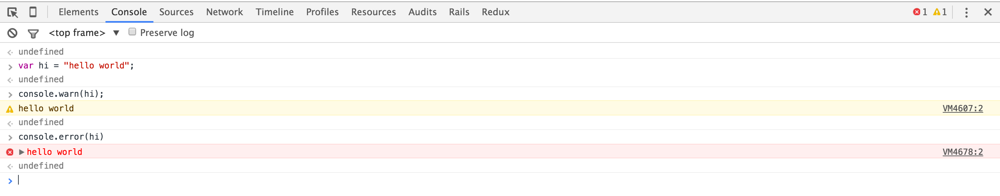
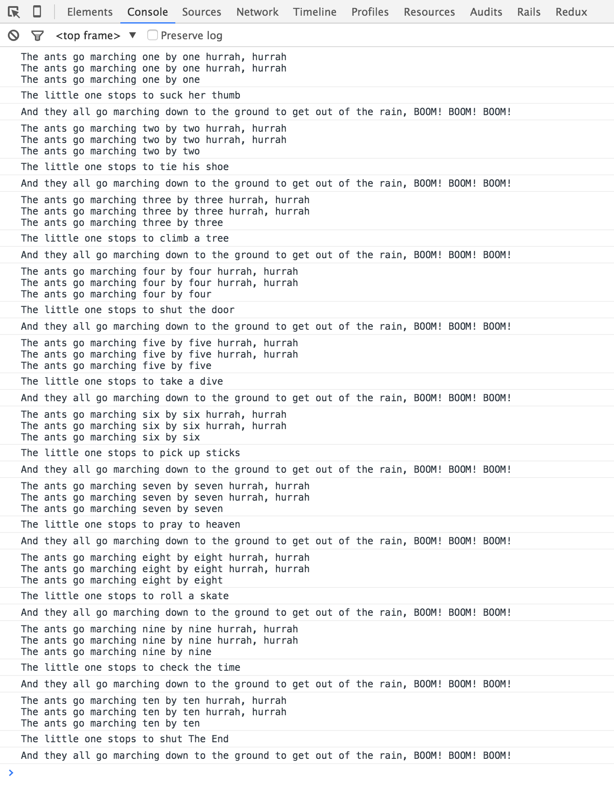
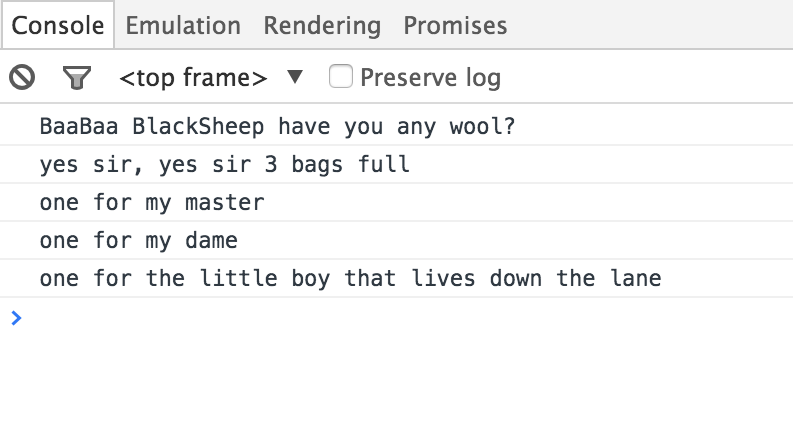

# Lesson 7 - JS in the Browser && DOM && Debugging

## Recap & Intro 

- Over the past few weeks we've gone over the fundamentals of JavaScript 
- As we move into the using JS in the browser, you will notice that it's a natural step. 
- All the hard work you've put in will result in 
	- The ability to quickly build real-time applications
	- A better understanding of JS libraries and the code of others
	- a lot of FUN!  

- Today's class is going to focus 3 things
	- how to load/interact with JS in your browser
	- your browser's developer tools
	- how to debug your code 


## Loading a Script
Load a script into an HTML page by adding a script tag

In the head tag

```html
<html>
  <head>
    <meta charset="utf-8">
    <title>A Page with JS</title>
    <script src="javascript/your_file.js" charset="utf-8"></script>
  </head>
  <body>
    
  </body>
</html>
```

In the body

```html
<!DOCTYPE html>
<html>
  <head>
    <meta charset="utf-8">
    <title>A Page with JS</title>
  </head>
  <body>
    <h1> Hello World</h1>

    <script type="text/javascript" src="javascript/your_file.js" charset="utf-8"></script>
  </body>
</html>
```

##### Blocking and Performance considerations

When loading a script in the head, you'll want to consider the concept of blocking.

When a page loads: 

- Resources in the page are blocked from downloading if they are below the script.
- Elements are blocked from rendering if they are below the script.

This can seriously affect a user's experience, and slow down your app's performance. So, be mindful of where you are referencing your JS. 


####Basic example script running in a page

*index.html*

```html
<body>
  <h1 id="greeting"> Hi! </h1>

  <script type="text/javascript" src="javascript/main.js"></script>
</body>
```

*javascript/main.js*

```javascript
function greetOnLoad () {
    var name = prompt("Hi! What's your name?");
    var myelement = document.getElementById("greeting");
    greeting.innerHTML= "Hello " + name + ", it's nice to meet you!";
}

greetOnLoad();
```

### Inline vs External

Above you have seen how to load a script *externally*. However, you can also embed your js right in your html page. This is called *inline* scripting. 

##### Inline Examples

```html
  <body>
    <p id="example">Lorem ipsum dolor sit amet <br> Yes, this is a random paragraph </p>
    <button type="button" onclick="modifyColor()">Click Me</button>
    <script>
    function modifyColor() {
        document.getElementById("example").style.color = "aqua";
        document.getElementById("example").style.backgroundColor = "gray";
    }
    </script>
  </body>

```

```html
<body>
  <button type="button" onclick="alert(Math.floor(Math.random() * (7 - 1)) + 1)">Click Me</button>

  <script type="text/javascript" src="javascript/main.js"></script>
</body>
```

While inline scripting may seem convenient, it is not recommended. 

##### Comparison

**Inline scripts**

- Difficult to maintiain
- Larger HTML file size
- Does not cache

**External scripts**

- Maintainable
- Once an external script is downloaded, the browser stores it in the cache so if another page reference it no additional download is required.
- Can be used to load client code on demand and reduce overall download time and size.


## Chrome Dev Tools Part1 / JS console
Chrome includes developer tools that let you: 

- inspect the state of JS on your page 
- send commands
- debug 

In addition to that

- variables (from your `.js` files) are visible and editable

to access your console you can:

- right click
- choose: inspect element
- click on the console tab

Alternatively, you can use the keyboard shortcut `command` + `option` + `j`


By now, you are well familiar with console.log, However, your console has a few other handy actions 

- console.warn
- console.error

Let's see what both look like in action:



## Global Objects

The global object is created as soon as the Javascript interpreter starts. For Javascript running inside a browser, this means that as soon as a new page is loaded by the browser, the global object will be created.

**Meaning: When scripts are loaded into an html document, the browser inserts some globals**

In browsers, the `window` object doubles as the `global` object

Essentially, when your working with JS in the browser, `this` initially refers the `window`

some examples: 

```javascript
window.alert();
window.prompt();
window.confirm();
```
is the same as:

```javascript
this.alert();
this.prompt();
this.confirm();
```

Other kinds of data types that loaded into global include:

- functions such as: `parseFloat()`
- properties such as `NaN` 
- objects such as `Math`

In summary, the `Window` object is basically a representation of an individual browser window.

## Document Object Model	
The most important global object is `window.document`. It represents the HTML document loaded in the window.

- DOM is a tree of nodes


- DOM provides methods for finding and editing all nodes from JS

[The HTML DOM Document Object](http://www.w3schools.com/jsref/dom_obj_document.asp)

[The HTML DOM Element Object](http://www.w3schools.com/jsref/dom_obj_all.asp)


The DOM and the nodes have an API that lets you find nodes and edit them directly. This isn't terribly useful by itself, but it lays foundational concepts.


running `window.document` in your console will give you access to the entire Document Object


### Find a node
```javascript
//Get an element ById
const myElement = document.getElementById('myEl');

//Get a collection of elements by tag name
const paragraphs = document.getElementsByTagName('p');

//Get a collection of elements by class name
const activeEls = document.getElementsByClassName('active');

//Get elements by a CSS Selector
const matches = document.querySelectorAll('#header p.active');

```

We'll dive deeper into the DOM in our next class.

## Location

The `window.location` object can be used to get the current page address (URL) and to redirect the browser to a new page.

```javascript
window.location.href
// returns the href (URL) of the current page

window.location.hash
// sets or returns the anchor part of a URL, including the hash sign (#)

window.location.hostname
//returns the domain name of the web host
```

To see this in action, try this is the console (from any page)

```javascript
window.location.href = "http://www.google.com"
```
## History

The `history` interface allows to manipulate the browser session history, that is the pages visited in the tab or frame that the *current* page is loaded in.

- `window.history.back();` Goes to the previous page in session history, (the same action as when the user clicks the browser's Back button) 
- `window.history.forward();` Goes to the next page in session history, (the same action as when the user clicks the browser's Forward button)
- `window.history.go();` 
	- takes an argument
	- `window.history.go(1);` moves forward one page
	- `window.history.go(-1);` moves back one page 

- HTML5 pushstate
The `history.pushState()` method adds a state to the browsers history.

```javascript
const stateObj = { foo: "bar" };
history.pushState(stateObj, "page 2", "bar.html");
```
Running the above code will cause the URL bar to display `http://your-site-name.com/bar.html`

`pushState()` takes three parameters: 

- a state object
- a title (which is currently ignored)
- an optional URL


## Dimensions and Position

- `window.innerWidth` returns the inner width of a window's content area.
- `window.innerHeight` returns the inner height of a window's content area. 

*note: these properties are read-only.*

Another nifty feature is `window.scrollY` and `window.scrollX`

X and Y represent the X and Y axis of the window

- Y is the number of pixels that the document is currently scrolled from the top
- X is the number of pixels that the document is currently scrolled from the left

```javascript
// scroll to the bottom of a page and then paste this into the console

if (window.scrollY) {
  window.scroll(0, 0);  // will reset the scroll position to the top left of the document.
}
```

```javascript
var y = window.scrollY;

window.scroll(0, 0);

window.scroll(0, y);
```


## localStorage & sessionStorage

Storage objects are simple key-value pairs (similar to objects) they stay intact through page loads.  

- The **keys** can be strings or integers
- the **values** are always strings.  
- You can access these values like an object 
- or with the `getItem()` and `setItem()` methods. 


The `sessionStorage` property allows you to access a session `Storage` object. 

- Data stored in `sessionStorage` gets cleared when the page session ends. 
- A page session lasts for as long as the browser is open and survives over page reloads
- Opening a page in a new tab or window will cause a new session to be initiated 

`localStorage` while property similar to `sessionStorage` has: 

- no expiration time 
- persists even when the browser is closed and re-opened

The `setItem()` method will add (or update) a key/value pair to the Storage object

```javascript
localStorage.setItem('bgcolor', 'aqua');
```

While the `getItem()` method will return that key's value.

```javascript
localStorage.getItem('bgcolor'); // "aqua"
```

Mozilla has a great demonstration at `http://mdn.github.io/web-storage-demo/`

head over there and play around with it, while calling `localStorage` to see the key/value pairs


This is a great time to introduce the idea of serialization...

You may have noticed that these key/value pairs resemble JSON. However, Attempting to store a JSON object in local storage will result in an error. 

Local storage requires you to store **strings** of information. 
*To store a JSON object in local storage you will need to convert it into a JSON-formatted string*, using the `JSON.stringify()` function.

```javascript
const user = {
  name : "Jimmy",
  job : "instructor"
};

var storeUser = JSON.stringify(user);

localStorage.setItem('userInfo', storeUser);

localStorage.getItem('userInfo');
// "{"name":"Jimmy","job":"instructor"}"

var parsedData = localStorage.getItem('userInfo');

console.log(parsedData);
// {"name":"Jimmy","job":"instructor"}

```


## Exercise 1
- Loading your Rock Paper Scissors script into an HTML page
- Once loaded: 
	- Access the variables/arrays
	- Call functions from console
- Make the program interactive 
- Ask the user for input 
- Place the winning results on the page


##Chrome developer tools Part 2


### Elements tab
- Edit HTML
- edit styles
- find by magnifying glass

### Sources / Debugging
- Setting breakpoints / conditional
- Step over, into, out
- Watch variables

### Network tab
- timeline / performance
- Headers / response

### Resources
- LocalStorage
- Cookies,
- AppCache


## Exercise

Debug the following code: 

```javascript
var littleOne = [];
var howTheyMarch = ["one by one", "two by two", "three by three", "four by four", "five by five", "six by six", "seven by seven", "eight by eight", "nine by nine", "ten by ten"];

function theAntsGoMarching(){
	for (var i = 0; i < howTheyMarch.length; i++){
		howManyByHowMany;
		console.log(littleOne[i]);
		console.log("And they all go marching down to the ground to get out of the rain, BOOM! BOOM! BOOM!");
	}
}
theAntsGoMarching();

littleOne[0] = "The little one stops to suck her thumb";
littleOne[1] = "The little one stops to tie his shoe";
littleOne[2] = "The little one stops to climb a tree";
littleOne[3] = "The little one stops to shut the door";
littleOne[4] = "The little one stops to take a dive";
littleOne[5] = "The little one stops to pick up sticks";
littleOne[6] = "The little one stops to pray to heaven";
littleOne[7] = "The little one stops to roll a skate";
littleOne[8] = "The little one stops to check the time";
littleOne[9] = "The little one stops to shut The End";

function howManyByHowMany(number){
	var numbers = howTheyMarch;
	var hurrah = " hurrah, hurrah \n";
	var march = "The ants go marching " + numbers;
  debugger
	console.log(march + hurrah + march + hurrah + march);
}
```

- Create a new project in your TTS directory titled antsGoMarching
	- add an index.html file
	- add a javascript file 
	- link the two files together
- In your JS file paste the above code
- there are several errors in this code sample 
	- use your debugger to track those errors down 
- We've already given you a `debugger` statement to start with. 
- Your finished output should be something like this:



### Exercise Answer:

```javascript
Will be updated later punks
```

## Exercise 

- Same as before, work through this code using the Developer Debugging tools

```javascript
var woolOwners = [
  {
	  "master": 1
  },
  {
  	"dame": 1
  },
  {
	"little boy": 1,
	"location": "down the lane"
  }
];


var bags = haveYouAnyWool;

var haveYouAnyWool = function() {
	for (var i = 0; i < woolOwners.length; i++) {
	var totalBags = totalBags + i;
	}
	return (i);
};


function baabaaBlackSheep() {
	console.log("BaaBaa BlackSheep have you any wool?");
	if (bags > 0) {
		console.log("yes sir, yes sir " + totalBags + " bags full");
  }
}

function oneForMy() {
	for (var i = 0; i < 2; i++) {
		people = Object.keys(woolOwners);
		var person = people.toString();
		console.log("one for my " + person);
	}
}

baabaaBlackSheep();
oneForMy();

var boy = Object.keys(woolOwners[2]);
var littleBoy = boy[2];

var whereHeLives = littleBoy.location;
console.log("one for the " + littleBoy + " that lives " + whereHeLives);
```

- your output should be:
 


<!--### Exercise Answer -->

<!--```javascript-->
<!--var woolOwners = [-->
<!--  {-->
<!--	  "master": 1-->
<!--  },-->
<!--  {-->
<!--  	"dame": 1-->
<!--  },-->
<!--  {-->
<!--	"little boy": 1,-->
<!--	"location": "down the lane"-->
<!--  }-->
<!--];-->


<!--var haveYouAnyWool = function() {-->
<!--	for (var i = 0; i < woolOwners.length; i++) {-->
<!--	var totalBags = totalBags + i;-->
<!--	}-->
<!--	return (i);-->
<!--};-->

<!--var bags = haveYouAnyWool();-->

<!--function baabaaBlackSheep() {-->
<!--	console.log("BaaBaa BlackSheep have you any wool?");-->
<!--	if (bags > 0) {-->
<!--		console.log("yes sir, yes sir " + bags + " bags full");-->
<!--  }-->
<!--}-->

<!--function oneForMy() {-->
<!--	for (var i = 0; i < 2; i++) {-->
<!--		people = Object.keys(woolOwners[i]);-->
<!--		var person = people.toString();-->
<!--		console.log("one for my " + person);-->
<!--	}-->
<!--}-->

<!--baabaaBlackSheep();-->
<!--oneForMy();-->

<!--var boy = Object.keys(woolOwners[2]);-->
<!--var littleBoy = boy[0];-->

<!--var whereHeLives = woolOwners[2].location;-->
<!--console.log("one for the " + littleBoy + " that lives " + whereHeLives);-->
<!--```-->
	
<!--
- Some scripts with errors that you have to debug
	- Error in a script
	- Network error
	- Setting breakpoints
	- step over, step into
	- Set and get stuff from local storage 	-->


## Homework

- Complete the [BaaBaaBlackSheep](https://github.com/ttsJavaScriptAppDevelopmentSummer16/classNotes/blob/master/Lesson%2007%20-%20JavaScript%20in%20the%20Browser.md#exercise-1) debugging challenge (individually)
  - Push the code to repo with the naming convention: `js_debugging_YOUR_INTIALS_HERE`
  - Clone the repo and create a new branch to work from 
- Read this [excellent blog post](http://juliepagano.com/blog/2014/05/18/javascript-debugging-for-beginners/) about developer tools.
- Complete the [Discover DevTools](https://www.codeschool.com/courses/discover-devtools) course at CodeSchool

